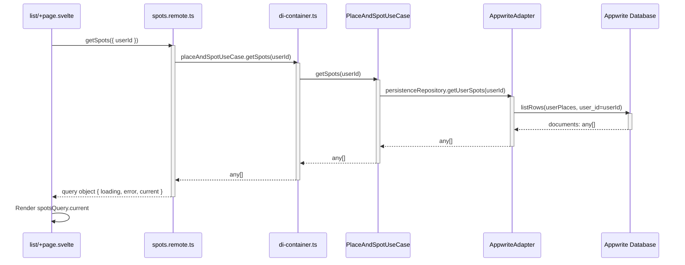

# Data Flow: List Page (`/list`)

This document traces the data flow from `src/routes/list/+page.svelte` through the application architecture.

## Overview

The list page displays a user's saved spots. The data flows through multiple layers following a clean architecture pattern:

1. **UI Layer** (Svelte Component)
2. **Remote/API Layer** (SvelteKit Query)
3. **DI Container** (Dependency Injection)
4. **Use Case Layer** (Business Logic)
5. **Adapter Layer** (Infrastructure)
6. **Data Source** (Appwrite Database)

## Sequence Diagram

The following sequence diagram shows the chronological flow of calls:



## Data Flow Diagram

```mermaid
graph TB
    subgraph "UI Layer"
        A[list/+page.svelte]
        A1[spotsQuery = getSpots]
        A2[Render spotsQuery.current]
    end

    subgraph "Remote/API Layer"
        B[spots.remote.ts]
        B1[getSpots query function]
        B2[placeAndSpotUseCase.getSpots]
    end

    subgraph "DI Container"
        C[di-container.ts]
        C1[placeAndSpotUseCase]
        C2[AppwriteAdapter instance]
    end

    subgraph "Use Case Layer"
        D[placeAndSpot.ts]
        D1[PlaceAndSpotUseCase.getSpots]
        D2[persistenceRepository.getUserSpots]
    end

    subgraph "Adapter Layer"
        E[appwrite/index.ts]
        E1[AppwriteAdapter.getUserSpots]
        E2[tablesDB.listRows]
    end

    subgraph "Infrastructure"
        F[appwrite/server-client.ts]
        F1[tablesDB client]
    end

    subgraph "Data Source"
        G[(Appwrite Database)]
        G1[userPlaces table]
    end

    A -->|calls| A1
    A1 -->|imports| B
    A2 -->|displays| A1
    
    B -->|defines| B1
    B1 -->|calls| B2
    B2 -->|imports| C
    
    C -->|exports| C1
    C1 -->|uses| C2
    C2 -->|implements| D
    
    D -->|contains| D1
    D1 -->|calls| D2
    D2 -->|delegates to| E
    
    E -->|contains| E1
    E1 -->|calls| E2
    E2 -->|uses| F
    
    F -->|provides| F1
    F1 -->|queries| G
    
    G -->|returns| G1
    G1 -->|documents| E2
    E2 -->|any[]| E1
    E1 -->|any[]| D2
    D2 -->|any[]| D1
    D1 -->|any[]| B2
    B2 -->|any[]| B1
    B1 -->|query object| A1
    A1 -->|reactive state| A2

    style A fill:#e1f5ff
    style B fill:#fff4e1
    style C fill:#f0e1ff
    style D fill:#e1ffe1
    style E fill:#ffe1f0
    style F fill:#ffe1f0
    style G fill:#ffcccc
```

## Alternative Flow (Commented Out)

There's an alternative data flow path that's currently commented out in the page component:

```mermaid
graph LR
    A[list/+page.svelte] -->|commented| B[spotsPageList]
    B -->|calls| C[listSpotsByUserUseCase]
    C -->|uses| D[getSpotListByIdAdapter]
    D -->|queries| E[Appwrite Database]
    E -->|returns| F[transformDocsToList]
    F -->|ISpot[]| C
    C -->|ISpot[]| B
    B -->|callback| A

    style A fill:#e1f5ff
    style B fill:#fff4e1
    style C fill:#e1ffe1
    style D fill:#ffe1f0
    style E fill:#ffcccc
    style F fill:#fff4e1
```

## Component Details

### 1. UI Layer: `src/routes/list/+page.svelte`

**Key Code:**
```typescript
const spotsQuery = getSpots({ userId: '665d17e8000fa5d7acca'})
```

**Responsibilities:**
- Initiates data fetching via SvelteKit's `query` function
- Displays loading, error, and success states
- Renders the list of spots

**Data Flow:**
- Input: `userId` (hardcoded string)
- Output: Reactive query object with `loading`, `error`, and `current` properties

### 2. Remote Layer: `src/routes/spots.remote.ts`

**Key Code:**
```typescript
export const getSpots = query(
  spotsSchema,
  async ({ userId }) => {
    const spots = await placeAndSpotUseCase.getSpots(userId)
    return spots
  }
)
```

**Responsibilities:**
- Defines the query schema (Zod validation)
- Wraps the use case call in SvelteKit's `query` function
- Provides reactive state management

**Data Flow:**
- Input: `{ userId: string }` (validated by Zod schema)
- Output: `any[]` (array of spot documents)

### 3. DI Container: `src/lib/_glue/di-container.ts`

**Key Code:**
```typescript
export const placeAndSpotUseCase = new PlaceAndSpotUseCase(appwriteAdapter);
```

**Responsibilities:**
- Instantiates use cases with appropriate adapters
- Provides a single point of configuration
- Enables easy switching between adapters (Appwrite vs Local Dev)

**Current Configuration:**
- Uses `appwriteAdapter` (can be switched to `localDevAdapter`)

### 4. Use Case Layer: `src/lib/_use_cases/placeAndSpot.ts`

**Key Code:**
```typescript
async getSpots(userId: string) {
  return this.persistenceRepository.getUserSpots(userId);
}
```

**Responsibilities:**
- Encapsulates business logic for retrieving spots
- Delegates to the persistence repository interface
- Provides a clean abstraction over data access

**Data Flow:**
- Input: `userId: string`
- Output: `Promise<any[]>` (array of spot documents)

### 5. Adapter Layer: `src/lib/_adapters/secondary/appwrite/index.ts`

**Key Code:**
```typescript
async getUserSpots(userId: string): Promise<any[]> {
  const { total, documents } = await this.database.listRows({
    databaseId: DATABASE_ID,
    tableId: COLLECTIONS.userPlaces,
    queries: [Query.equal('user_id', userId)],
    total: true
  });
  return documents
}
```

**Responsibilities:**
- Implements the `PersistenceRepository` interface
- Handles Appwrite-specific database operations
- Transforms Appwrite responses to application format

**Data Flow:**
- Input: `userId: string`
- Output: `Promise<any[]>` (Appwrite document array)

### 6. Infrastructure: `src/lib/_adapters/secondary/appwrite/server-client.ts`

**Responsibilities:**
- Configures Appwrite client for server-side operations
- Provides `tablesDB` instance for database operations

### 7. Data Source: Appwrite Database

**Structure:**
- Database: `bite_marks`
- Table: `places_user` (userPlaces)
- Query: Filters by `user_id` field

**Data Format:**
- Returns Appwrite document objects with `$id`, `$createdAt`, etc.
- Contains nested `place_id` relation to master places

## Data Transformation

The raw Appwrite documents are returned directly to the UI layer. The transformation happens implicitly through SvelteKit's reactive query system:

1. **Initial State**: `loading: true`, `current: undefined`
2. **Loading State**: Query executes, data fetched from Appwrite
3. **Success State**: `loading: false`, `current: any[]` (array of documents)
4. **Error State**: `error: string`, `current: undefined`

## Key Files Reference

| Layer | File | Purpose |
|-------|------|---------|
| UI | `src/routes/list/+page.svelte` | Page component that displays spots |
| Remote | `src/routes/spots.remote.ts` | SvelteKit query definitions |
| DI | `src/lib/_glue/di-container.ts` | Dependency injection configuration |
| Use Case | `src/lib/_use_cases/placeAndSpot.ts` | Business logic for spots |
| Adapter | `src/lib/_adapters/secondary/appwrite/index.ts` | Appwrite implementation |
| Port | `src/lib/_ports/persistence.repository.ts` | Repository interface |
| Infrastructure | `src/lib/_adapters/secondary/appwrite/server-client.ts` | Appwrite client setup |

## Notes

- The current implementation uses a hardcoded `userId` in the page component
- There's a commented-out alternative flow using `spotsPageList` controller
- The adapter can be switched between Appwrite and Local Dev via DI container
- The data is returned as raw Appwrite documents without transformation in the main flow
- The alternative flow includes a presenter (`transformDocsToList`) that transforms documents to `ISpot[]` format

