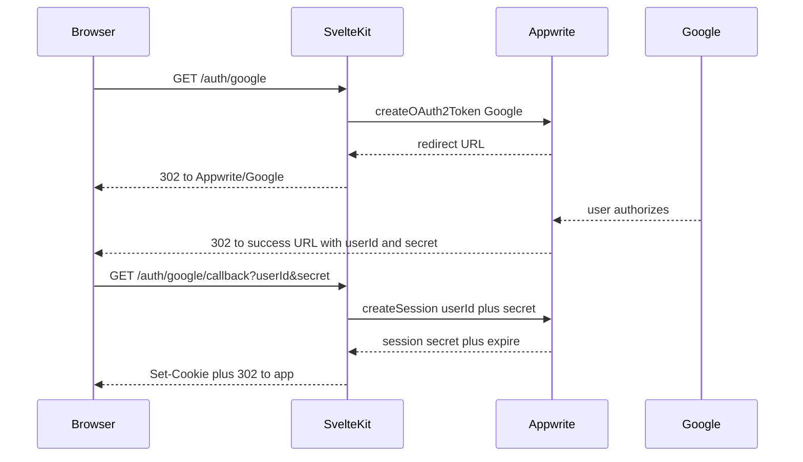

# OAuth / social sign-in (Appwrite + SvelteKit)

Guide for adding and operating social sign-in in Bite Marks. The app uses **server-side rendering (SSR)** with Appwrite: the browser never holds the session secret in JavaScript; the server sets an **httpOnly** cookie after login.

See also [AUTH-README.md](../AUTH-README.md) for the full auth system (email login, hooks, route guards, logout).

## Overview

| Concern | Approach |
|--------|----------|
| Backend | [Appwrite Auth](https://appwrite.io/docs/products/auth) |
| Pattern | [Appwrite SSR — OAuth2](https://appwrite.io/docs/products/auth/server-side-rendering#oauth2) |
| Session storage | Cookie `a_session_${APPWRITE_PROJECT_ID}` = `session.secret` |
| Architecture | UI → route / remote handler → use-case → `AuthRepository` → Appwrite adapter |

**Implemented today:** Google (`/auth/google`, `/auth/google/callback`). Email/password uses the same session cookie via `login.remote.ts`.

## Flow (Google)

1. **Start** — `GET /auth/google` calls `account.createOAuth2Token({ provider: Google, success, failure })` and redirects the browser to Appwrite.
2. **Provider** — User signs in with Google; Appwrite handles the OAuth redirect chain.
3. **Callback** — Appwrite redirects to your **success** URL with `userId` and `secret` query parameters.
4. **Session** — Callback route calls `account.createSession({ userId, secret })`, sets the session cookie, redirects into the app (e.g. `/list`).

## Appwrite Console setup

### 1. Enable the provider

- **Auth → Providers → Google** (or another provider).
- Paste **Client ID** and **Client secret** from your identity provider.

### 2. Google Cloud (for Google)

- [Google Cloud Console](https://console.cloud.google.com/apis/credentials) → OAuth 2.0 Client.
- Add the **Authorized redirect URI** shown in **Appwrite** for Google (Google redirects to **Appwrite**, not your SvelteKit app).
- Your app only passes **success** / **failure** URLs to `createOAuth2Token`; those must use hostnames allowed in Appwrite platforms (below).

### 3. Platforms

- **Project → Platforms** — register dev and production hostnames (e.g. `localhost`, production domain).
- OAuth `success` and `failure` URLs must match allowed hostnames or Appwrite rejects them (open-redirect protection).

### 4. API key (server)

- `APPWRITE_API_KEY` needs scopes that allow OAuth token creation and sessions (e.g. **`sessions.write`** per [Appwrite SSR docs](https://appwrite.io/docs/products/auth/server-side-rendering)).
- Used by `createAdminAccount()` in `server-client.server.ts`.

### 5. Session length (~1 week)

- **Auth → Security** — set session duration to **7 days** (or your target).
- The app sets cookie `expires` from `session.expire`; new logins pick up the Console TTL.
- Appwrite session expiry is based on **creation time**, not sliding “last activity” unless you add refresh logic later.

## Code map (current implementation)

| Piece | File |
|-------|------|
| OAuth start | `src/routes/auth/google/+server.ts` |
| OAuth callback | `src/routes/auth/google/callback/+server.ts` |
| Canonical app origin | `src/lib/adapters/secondary/appwrite/app-base-url.server.ts` (`PUBLIC_APP_URL` optional) |
| Port | `src/lib/ports/auth.repository.ts` — `getGoogleOAuthRedirectUrl`, `completeOAuthLogin` |
| Adapter | `src/lib/adapters/secondary/appwrite/auth.ts` — `OAuthProvider.Google`, `createOAuth2Token`, `createSession` |
| Use case | `src/lib/use_cases/authorization.ts` |
| Session cookie | `src/lib/adapters/secondary/appwrite/server-client.server.ts` — `setAppwriteSessionCookie`, `clearAppwriteSessionCookie` |
| Login UI | `src/routes/login/+page.svelte` — link to `/auth/google` |
| Route guard | `src/routes/+layout.server.ts` — allow `/auth/google` when logged out |
| Logout | `src/routes/logout/+server.ts` — delete Appwrite session + clear cookie |

## Adding another provider (e.g. GitHub)

Follow the same SSR pattern:

1. **Appwrite Console** — enable provider; configure credentials and redirect URIs at the provider.
2. **Adapter** — add a method that calls `createOAuth2Token({ provider: OAuthProvider.Github, success, failure })`.
3. **Routes** — e.g. `src/routes/auth/github/+server.ts` and `.../callback/+server.ts` (or one shared callback with a `provider` param if you prefer).
4. **Callback** — validate `userId` and `secret`, `createSession`, `setAppwriteSessionCookie`, redirect.
5. **Layout** — whitelist `/auth/github` (and callback) in `+layout.server.ts` for unauthenticated users.
6. **UI** — button/link on login page.

Reuse `getAppBaseUrl(event)` for absolute success/failure URLs.

## Environment

| Variable | Purpose |
|----------|---------|
| `PUBLIC_APPWRITE_ENDPOINT` | Appwrite API endpoint |
| `APPWRITE_PROJECT_ID` | Project ID (cookie name suffix) |
| `APPWRITE_API_KEY` | Server admin client (OAuth + sessions) |
| `PUBLIC_APP_URL` (optional) | Canonical origin for OAuth redirects when not using `event.url.origin` (proxy, fixed prod URL) |

## Session cookie

- **Name:** `a_session_${APPWRITE_PROJECT_ID}`
- **Value:** `session.secret`
- **Flags:** `httpOnly`, `path: /`, `secure: !dev`, **`sameSite: "lax"`**

Use **`lax`** (not `strict`) for both email and OAuth. OAuth completes via a top-level navigation back from Google/Appwrite; `strict` can prevent the cookie from being sent on that first return.

## Security

- **Validate callback params** — require non-empty `userId` and `secret`; on failure redirect to `/login?oauth=...` with generic messages (no internal errors in the URL).
- **Failure URL** — point `createOAuth2Token` failure to `/login?oauth=error` (or similar).
- **Do not log** API keys or session secrets.
- **Logout** — use server `GET /logout` so the httpOnly cookie is cleared; browser-only `Account.deleteSession` does not remove the server cookie.

## Checklist (new environment)

- [ ] Google (or provider) enabled in Appwrite with valid client ID/secret
- [ ] Provider redirect URI points at Appwrite (from Console)
- [ ] App hostnames added under **Platforms**
- [ ] API key has session/OAuth scopes
- [ ] Session length set in **Auth → Security** (e.g. 7 days)
- [ ] `PUBLIC_APP_URL` set in production if origin differs from request URL
- [ ] Email login still works; Google flow reaches `/list`; logout returns to `/login`

## References

- [Appwrite Auth](https://appwrite.io/docs/products/auth)
- [Appwrite SSR / OAuth2](https://appwrite.io/docs/products/auth/server-side-rendering#oauth2)
- [AUTH-README.md](../AUTH-README.md) — hooks, email login, route protection
